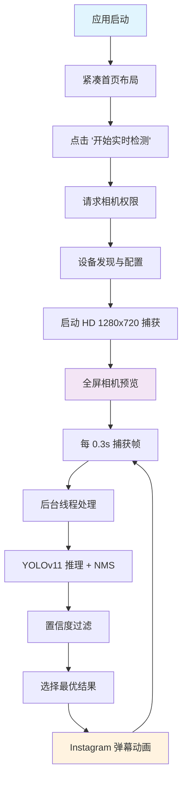

# YOLOv11 实时检测 iOS 应用

## 项目概述

本项目是一个基于 SwiftUI 6 和 iOS 18 的专业级实时物体检测应用，集成 YOLOv11 CoreML 模型，支持 80 种 COCO 数据集对象的实时识别。应用采用现代化设计，具备 Instagram 风格的直播弹幕效果、智能相机切换和实时参数调节功能。

## ✨ 核心功能特性

### 🎯 实时检测功能
- **高性能检测**: 基于 YOLOv11 模型，支持 80 种 COCO 对象类别
- **Apple Neural Engine 加速**: 优化推理性能，~30ms 检测时间
- **智能 NMS 后处理**: 可配置置信度 (0.1-0.9) 和 IoU 阈值 (0.1-0.9)
- **实时参数调节**: 右上角滑条实时调整检测参数

### 📱 用户界面
- **紧凑首页布局**: 居中设计，优化视觉层次
- **全屏摄像头预览**: HD 1280x720 分辨率
- **Instagram 风格弹幕**: 从左下角垂直向上移动的检测结果展示
- **智能相机切换**: 1x/0.5x 按钮，支持普通/超广角镜头切换

### 🎪 弹幕系统
- **垂直动画**: 模仿 Instagram 直播弹幕，从底部向屏幕中央移动
- **智能频控**: 每 0.8 秒最多显示一个弹幕，避免界面拥挤
- **最优结果**: 仅显示置信度最高的检测结果
- **自动清理**: 防止内存泄漏，最多同时显示 8 个弹幕

## 🏗️ 技术架构

### 现代 iOS 技术栈
- **SwiftUI 6**: 采用最新 @Observable 宏，替代传统 ObservableObject
- **iOS 18**: 使用 NavigationStack 等现代导航组件
- **AVFoundation**: 专业相机控制和设备发现
- **CoreML + Vision**: 高效模型推理和图像处理
- **MVVM 架构**: 清晰的代码分层和状态管理

### 核心组件

#### 1. YOLOv11Predictor (直接集成)
```swift
// 位置: yolo11/Shared/Services/YOLOv11Predictor.swift
- 直接模型加载，无需外部 SDK 依赖
- 完整 YOLO 输出解析 [1, 84, 8400] 格式
- 内置 NMS 后处理算法
- 80 个 COCO 类别标签支持
- Apple Neural Engine (.computeUnits = .all) 加速
```

#### 2. 智能相机系统
```swift
// 位置: yolo11/Shared/Extensions/UIViewRepresentable+.swift
- AVCaptureDevice.DiscoverySession 设备检测
- 支持 .builtInWideAngleCamera 和 .builtInUltraWideCamera
- 动态会话配置和设备切换
- 防崩溃的 beginConfiguration/commitConfiguration 管理
```

#### 3. 响应式检测管道
```swift
// 位置: yolo11/Features/Camera/ViewModels/CameraViewModel.swift
- @Observable 宏实现的响应式状态管理
- 智能检测频率控制 (每 0.3 秒)
- 后台线程图像处理
- 主线程 UI 更新优化
```

## 📁 项目结构

```
yolo11/
├── App/
│   └── yolo11App.swift                    # 应用入口点
├── Features/
│   ├── Home/Views/
│   │   └── HomeView.swift                 # 优化的紧凑首页布局
│   └── Camera/
│       ├── Views/
│       │   └── CameraView.swift           # 相机界面 + NMS 滑条 + 切换按钮
│       ├── ViewModels/
│       │   └── CameraViewModel.swift      # @Observable 检测逻辑
│       └── Models/
│           └── DetectionResult.swift      # 检测结果数据结构
├── Shared/
│   ├── Components/
│   │   └── DetectionBannerView.swift      # Instagram 风格弹幕组件
│   ├── Services/
│   │   └── YOLOv11Predictor.swift        # 集成的 YOLO 预测器
│   └── Extensions/
│       └── UIViewRepresentable+.swift     # 相机预览和设备管理
└── Resources/
    └── yolo11n.mlpackage                  # CoreML 模型文件
```

## 🔄 检测流程



## ⚡ 性能优化亮点

### 1. 智能检测策略
- **频率控制**: 检测 0.3s/次，弹幕生成 0.8s/次
- **结果筛选**: 仅显示单次检测的最高置信度结果
- **内存管理**: 自动清理过期弹幕，防止内存泄漏

### 2. 相机优化
- **会话管理**: 正确的 beginConfiguration/commitConfiguration 流程
- **设备切换**: 无缝的普通/超广角镜头切换
- **线程安全**: 后台配置，主线程 UI 更新

### 3. UI 流畅性
- **SwiftUI 动画**: 原生动画引擎，3 秒弹幕移动
- **状态响应**: @Observable 宏确保高效状态更新
- **布局优化**: 紧凑设计，减少渲染负担

## 🛠️ 重大问题修复记录

### 崩溃修复 (关键)
**问题**: `startRunning may not be called between calls to beginConfiguration and commitConfiguration`
- **原因**: 在 AVCaptureSession 配置过程中错误调用 startRunning()
- **修复**: 重构设备配置流程，确保正确的配置顺序
- **影响**: 解决应用启动即崩溃的致命问题

### 弹幕效果重构
**问题**: 原有水平滚动弹幕，用户期望垂直 Instagram 风格
- **修复**: 实现垂直向上移动动画，从左下角到屏幕中央
- **优化**: 智能频率控制，避免弹幕过于密集

### 相机切换失效
**问题**: 1x/0.5x 按钮切换前后效果相同
- **修复**: 正确使用 AVCaptureDevice.DiscoverySession 检测设备
- **增强**: 添加设备支持检测和错误处理

## 📋 构建和运行

### 环境要求
- **Xcode**: 15.4+ 
- **iOS**: 18.0+ (部署目标)
- **设备**: 支持 Neural Engine 的 iPhone/iPad
- **权限**: 摄像头访问权限

### 构建命令

#### iOS 设备构建
```bash
xcodebuild -project "yolo11.xcodeproj" -scheme "yolo11" -sdk iphoneos18.5 -configuration Release
```

#### 模拟器构建 (调试)
```bash
xcodebuild -project "yolo11.xcodeproj" -scheme "yolo11" -sdk iphonesimulator -configuration Debug
```

#### 测试运行
```bash
xcodebuild test -project "yolo11.xcodeproj" -scheme "yolo11" -destination "platform=iOS Simulator,name=iPhone 15"
```

### 运行步骤
1. 克隆仓库到本地
2. 用 Xcode 打开 `yolo11.xcodeproj`
3. 选择目标设备 (iOS 18+ 设备)
4. 点击 Run (⌘+R) 或构建按钮
5. 允许相机权限访问

## 🎯 功能演示

### 主界面交互
1. **首页**: 紧凑居中布局，一键开始检测
2. **检测页**: 全屏相机预览
3. **参数调节**: 右上角置信度和 IoU 滑条
4. **相机切换**: 右下角 1x/0.5x 按钮
5. **弹幕效果**: 左下角垂直上升动画

### 检测效果
- 支持 80 种对象: 人、车、动物、物品等
- 实时显示: 对象名称 + 置信度分数
- 智能过滤: 自动选择最优检测结果

## 🚀 技术特色

### SwiftUI 6 现代化
- ✅ @Observable 宏替代 ObservableObject
- ✅ NavigationStack 现代导航
- ✅ 原生动画引擎
- ✅ 响应式 UI 设计

### CoreML 优化集成
- ✅ 直接模型集成，无外部依赖
- ✅ Vision 框架高效处理
- ✅ Neural Engine 硬件加速
- ✅ 完整 NMS 后处理算法

### 专业相机控制
- ✅ 多设备发现和切换
- ✅ HD 分辨率捕获
- ✅ 线程安全配置
- ✅ 崩溃防护机制

## 📄 许可证

本项目遵循 MIT 许可证。详见 LICENSE 文件。

## 🤝 贡献

欢迎提交 Pull Request 和 Issue！

---

**🤖 此项目由 Claude AI 协助开发，展示了现代 iOS 开发的最佳实践和 AI 辅助编程的强大能力。**