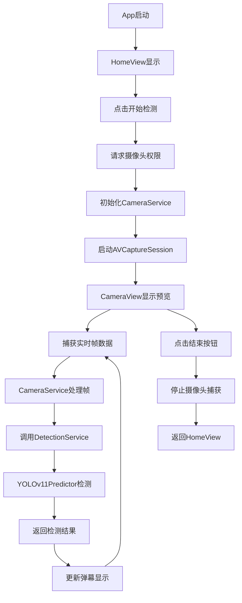

# YOLOv11 实时检测 iOS 应用

## 项目概述

本项目是一个基于 SwiftUI 6 和 iOS 18 的实时物体检测应用，使用 YOLOv11 CoreML 模型实现摄像头实时物体检测功能。应用具有直观的用户界面，能够在摄像头预览界面上以弹幕形式实时显示检测结果。

## 功能特性

- 首页"开始实时检测"按钮，启动摄像头检测功能
- 全屏摄像头实时预览界面
- 每秒 2-3 次本地 YOLOv11 物体检测
- 右上角"结束"按钮，一键返回首页
- 左下角检测结果弹幕动画效果，类似直播弹幕从底部向上移动
- 检测结果在移动到屏幕 2/3 高度时自动消失

## 技术架构

### 整体架构
- 遵循 iOS 18 SwiftUI 6 规范
- 采用 MVVM 架构模式
- 使用 @Observable 宏进行状态管理
- 通过 NavigationStack 实现页面导航

### 核心技术栈
- SwiftUI 6 (iOS 18+)
- AVFoundation (摄像头捕获)
- CoreML (YOLOv11 模型推理)
- Vision (图像处理)

## 项目结构

```
yolo11/
│
├── App/
│   ├── yolo11App.swift         // App入口
│   └── Dependencies.swift      // 依赖注入管理
│
├── Features/
│   ├── Home/
│   │   ├── Views/
│   │   │   └── HomeView.swift
│   │   └── ViewModels/
│   │       └── HomeViewModel.swift
│   └── Camera/
│       ├── Views/
│       │   ├── CameraView.swift
│       │   └── DetectionOverlayView.swift
│       ├── ViewModels/
│       │   └── CameraViewModel.swift
│       └── Models/
│           └── DetectionResult.swift
│
├── Shared/
│   ├── Components/
│   │   └── DetectionBannerView.swift
│   ├── Services/
│   │   └── CameraService.swift
│   └── Extensions/
│       └── UIViewRepresentable+.swift
│
├── Resources/
│   └── Assets.xcassets
│
├── YOLOv11_CoreML_SDK/          // 预训练模型SDK
└── yolo11.xcodeproj/
```

## 核心组件说明

### 1. CameraPreviewView
使用 UIViewRepresentable 包装 AVCaptureSession 实现摄像头实时预览功能，支持前后置摄像头切换和分辨率配置。

### 2. CameraService
处理摄像头捕获逻辑，包括：
- 摄像头权限请求
- AVCaptureSession 配置和管理
- 实时帧数据捕获 (AVCaptureVideoDataOutputSampleBufferDelegate)
- 帧率控制（每秒2-3帧）

### 3. DetectionService
协调摄像头数据和 YOLO 检测，负责：
- 图像格式转换 (CMSampleBuffer -> CGImage)
- 调用 YOLOv11Predictor 进行物体检测
- 检测结果缓存和去重处理

### 4. YOLOv11Predictor (来自SDK)
基于 CoreML 的 YOLOv11 物体检测器：
- 加载 yolo11n.mlpackage 模型
- 使用 Vision 框架进行图像推理
- 返回检测结果 (标签、置信度、边界框)

### 5. DetectionBannerView
实现检测结果的弹幕动画效果：
- 从屏幕左下角开始向上移动
- 在到达屏幕 2/3 高度时消失
- 支持多个弹幕同时显示
- 使用 SwiftUI 动画实现平滑过渡

### 6. Navigation Flow
- HomeView: 应用首页，包含"开始检测"按钮
- CameraView: 摄像头界面，包含预览、弹幕和结束按钮
- 使用 NavigationStack 实现页面跳转

## 实现流程



## 性能优化考虑

1. **帧率控制**: 限制每秒处理2-3帧，平衡检测效果和性能
2. **内存管理**: 及时释放图像数据，避免内存泄漏
3. **线程管理**: 后台线程处理图像和检测，主线程更新UI
4. **检测缓存**: 避免重复显示相同检测结果
5. **动画优化**: 使用SwiftUI原生动画，确保流畅性

## 依赖项

- YOLOv11_CoreML_SDK (包含预训练的 yolo11n.mlpackage 模型)
- iOS 18+ SDK
- Xcode 15.4+

## 开发规范

本项目严格遵循《SwiftUI 6 & iOS 18 开发规范 (2025年版)》：
- 最低部署目标设置为 iOS 18
- 全面使用 SwiftUI 6 新特性
- 采用 @Observable 宏进行状态管理
- 遵循 MVVM 架构模式

## 构建和运行

### 构建项目

要构建项目，请使用以下命令：

```bash
xcodebuild -project "yolo11.xcodeproj" -scheme "yolo11" -sdk iphoneos18.5 -configuration Release
```

或者直接在Xcode中打开项目并构建。

### 运行应用

1. 将iOS设备连接到Mac
2. 在Xcode中选择目标设备
3. 点击"Run"按钮或按Cmd+R运行应用

### 注意事项

- 应用需要摄像头权限，请确保在设置中允许访问摄像头
- 应用仅支持iOS 18.5及以上版本的设备
- 首次运行时可能需要一些时间来加载模型